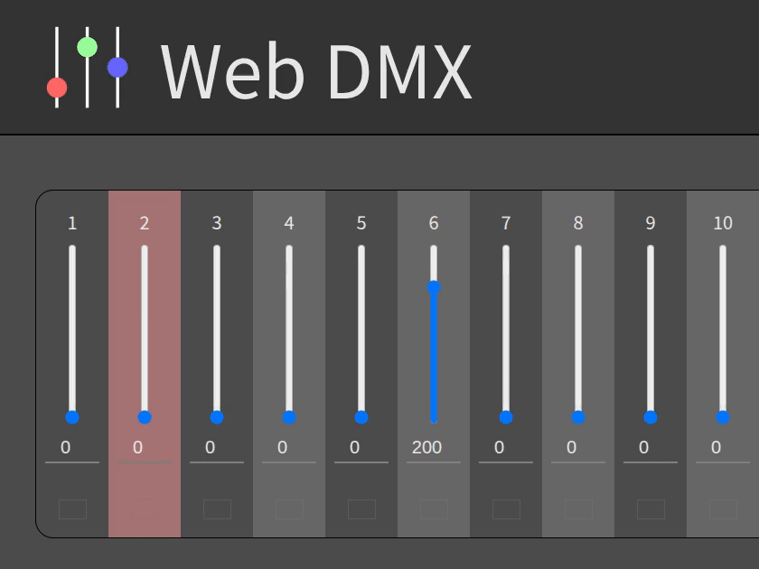
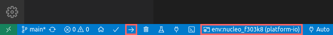

# Web DMX

DMX control on web application


[UI demo is available.](https://akuad.github.io/web-dmx/ui-demo/)

[Develop documentation is here.](https://akuad.github.io/web-dmx/)



## Usage

Work in progress

## Deployment

### 1. Device setting up

Open `src_fw` directory by [VSCode](https://code.visualstudio.com/) with [PlatformIO extension](https://marketplace.visualstudio.com/items?itemName=platformio.platformio-ide). Then set environment 'nucleo_f303k8', and upload.



Or you'd like to use CLI:

```sh
wget -O get-platformio.py https://raw.githubusercontent.com/platformio/platformio-core-installer/master/get-platformio.py
python3 get-platformio.py
rm get-platformio.py

cd src_fw/platform-io
pio run -e nucleo_f303k8 -t upload
```

### 2. WebApp setting up

Launch web server on [Node.js](https://nodejs.org/).

```sh
cd src_web
npm ci

# Without device
npm start

# With device
npm start <device path or COM port name>
```

### 3. Client access

Access to `http://<server-address>:8000/`. Now controller is ready.

> [!NOTE]
>
> On your local, `<server-address>` will be `localhost`.

## Using packages

[@std/fmt](https://jsr.io/@std/fmt) - Copyright (c) 2018-2022 the Deno authors.

[serve-static](https://www.npmjs.com/package/serve-static) - Copyright (c) 2010 Sencha Inc., 2011 LearnBoost, 2011 TJ Holowaychuk, 2014-2016 Douglas Christopher Wilson

[finalhandler](https://www.npmjs.com/package/finalhandler) - Copyright (c) 2014-2022 [Douglas Christopher Wilson](doug@somethingdoug.com)

[ws](https://www.npmjs.com/package/ws) - Copyright (c) 2011 [Einar Otto Stangvik](mailto:einaros@gmail.com), 2013 Arnout Kazemier and contributors, 2016 Luigi Pinca and contributors

## License

Web DMX - [CC0-1.0](./LICENSE)

@std/fmt - [MIT License](https://github.com/denoland/std/blob/main/LICENSE)

serve-static - [MIT License](https://github.com/expressjs/serve-static/blob/HEAD/LICENSE)

finalhandler - [MIT License](https://github.com/pillarjs/finalhandler/blob/master/LICENSE)

ws - [MIT License](https://github.com/websockets/ws/blob/master/LICENSE)
