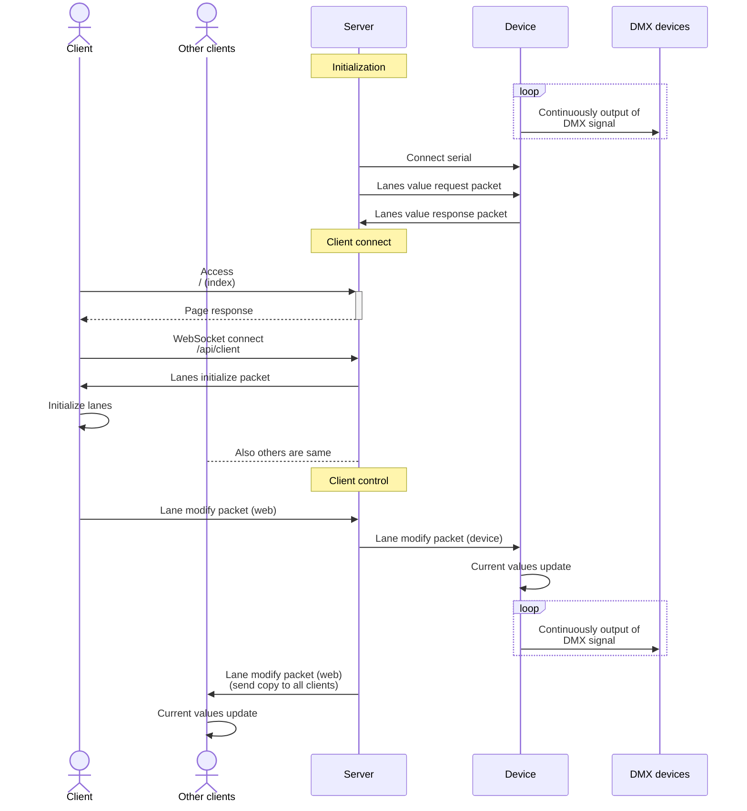

# Sequence diagrams

```mermaid
sequenceDiagram
  actor C as Client
  actor O as Other clients
  participant S as Server
  participant D as Device
  participant X as DMX devices

  note over S: Initialization
  loop
    D->>X: Continuously output of<br>DMX signal
  end
  S->>D: Connect serial
  S->>D: Lanes value request packet
  D->>S: Lanes value response packet

  note over S: Client connect
  C->>+S: Access<br>/ (index)
  S-->>-C: Page response
  C->>S: WebSocket connect<br>/api/client
  S->>C: Lanes initialize packet
  C->>C: Initialize lanes
  O-->S: Also others are same

  note over S: Client control
  C->>S: Lane modify packet (web)
  S->>D: Lane modify packet (device)
  D->>D: Current values update
  loop
    D->>X: Continuously output of<br>DMX signal
  end
  S->>O: Lane modify packet (web)<br>(send copy to all clients)
  O->>O: Current values update
```
