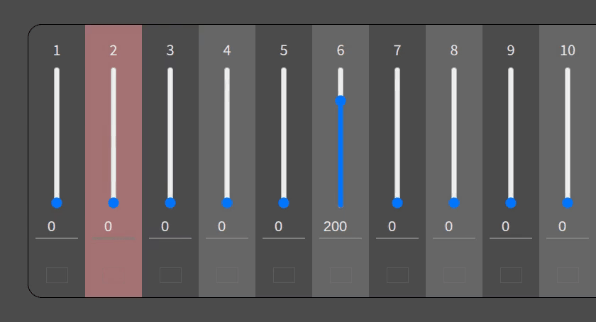

# Usage

Here is a client UI usage guide.

## Channel value control

The faders can control with mouse or cursor keys.

Mouse control:

Cursor key control:

- left/right key
  - Change current channel (current channel is red background)
- up/down key
  - Current channel value increase/decrease
- up/down key with holding:
  - Shift: 10 value/step
  - Ctrl: 50 value/step
  - Alt: 255 value/step

You'd like to try it? [UI demo is available.](https://akuad.github.io/web-dmx/ui-demo/)

## User label

You can write custom text above each faders.

